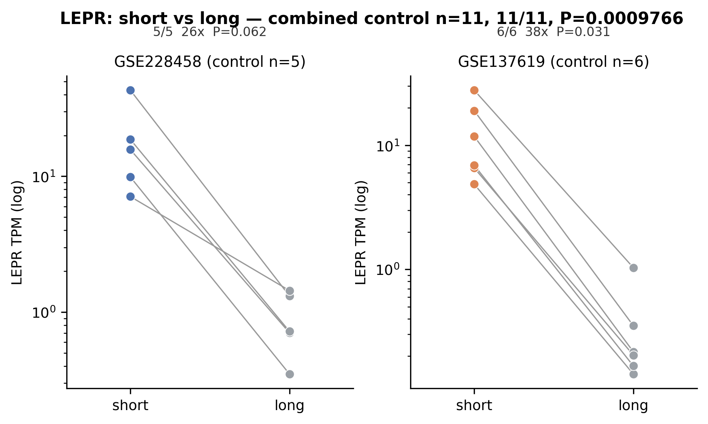

# isoform-dominance-pipeline

[](https://github.com/charliekim97/isoform-dominance-pipeline/actions/workflows/ci.yml)


**Config-driven quantification of isoform usage from bulk RNA-seq.**
Given a gene and its transcript isoforms, this pipeline answers one question end-to-end:
*which isoform group predominates in a tissue, and is the difference statistically robust?*
It takes raw reads → transcript-level abundance (Salmon) → per-donor isoform-group TPM →
paired statistics → a publication-style figure.



*Example output (bundled self-test data): the short LEPR isoform (LepRa) predominates over the
long isoform (LepRb) in control human choroid plexus across two independent cohorts; combined
n = 11, paired Wilcoxon P = 1×10⁻³.*

---

## Why this exists

Receptor and signalling genes are frequently expressed as multiple isoforms with distinct
functions (e.g. a signalling-competent long form vs a truncated transport/decoy short form).
"Which isoform dominates in tissue X?" is a recurring question, and answering it rigorously
from public bulk RNA-seq requires careful transcript-level quantification, sensible isoform
grouping, and the right paired statistics. This pipeline packages that workflow so the analysis
is **one config file away** for any gene and any dataset.

It was generalized from a published analysis of LEPR isoform usage in human choroid plexus
and **reproduces that result exactly** via the bundled self-test (below).

## What it does

```
config.json (gene + isoform groups)  +  sample_map.csv (donor, condition, SRR)
            │
   01  Salmon quant (HPC)      →  per-donor transcript TPM   (decoy-aware GENCODE index)
   02  extract isoform groups  →  per-donor group TPM + fraction
   03  paired stats + figure   →  Wilcoxon per cohort & combined  +  PNG/PDF/SVG
```

- **Transcript-level, decoy-aware quantification** (Salmon) — handles reads shared between
  isoforms via its EM model and avoids spurious assignment of intronic/unannotated reads.
- **Arbitrary isoform groups** — define any named sets of transcript IDs to compare.
- **Paired, non-parametric statistics** — two-sided exact Wilcoxon signed-rank within donors,
  per cohort and combined, with effect size (fold-change).
- **Reproducible** — pure-stdlib extraction step (runs on an HPC login node) and a deterministic,
  download-free self-test.

## Quickstart (no downloads — verify it works in seconds)

```bash
pip install -r requirements.txt
python3 test/run_test.py
```
Expected:
```
[OK] GSE228458 ... 5/5 P=0.0625
[OK] GSE137619 ... 6/6 P=0.03125
[OK] COMBINED  ... 11/11 P=0.0009766
[OK] figure produced
PASS — pipeline reproduces the published LEPR result.
```

## Full usage (real data)

**0. Build a decoy-aware index once** (example: human, GENCODE v44):
```bash
zcat GRCh38.primary_assembly.genome.fa.gz | grep "^>" | cut -d" " -f1 | sed 's/>//' > decoys.txt
cat gencode.v44.transcripts.fa.gz GRCh38.primary_assembly.genome.fa.gz > gentrome.fa.gz
salmon index -t gentrome.fa.gz -d decoys.txt -i decoy_index -k 31 -p 12
```

**1. Quantify (HPC).** Edit `INDEX`/`SAMPLE_MAP`/`SALMON` at the top of the sbatch, then:
```bash
sbatch scripts/01_salmon_quant.sbatch          # → quant/<donor>/quant.sf
```

**2. Extract isoform-group TPM** (per cohort):
```bash
python3 scripts/02_extract_isoform_tpm.py \
  --config config.json --quantdir quant \
  --samplemap example/sample_map_GSE228458.csv \
  --cohort GSE228458 --out perdonor_GSE228458.csv
```

**3. Statistics + figure:**
```bash
python3 scripts/03_stats_and_figure.py \
  --config config.json --condition control \
  --perdonor GSE228458=perdonor_GSE228458.csv \
  --perdonor GSE137619=perdonor_GSE137619.csv \
  --out results/dominance
```

## Apply it to a different gene

Edit `config.json` only:
```json
{
  "gene": "INSR",
  "groups": { "IR-A": ["ENST...", "ENST..."], "IR-B": ["ENST..."] },
  "primary_comparison": ["IR-A", "IR-B"]
}
```
Provide a `sample_map.csv` (donor, condition, SRR) for each dataset and run steps 1–3.

## Statistical notes

- **Test:** donor-level two-sided **exact Wilcoxon signed-rank** (`scipy.stats.wilcoxon`),
  reported per cohort and combined.
- **Small-n floor:** with n = 5 the minimum attainable two-sided exact P is 0.0625; a single
  small cohort therefore cannot reach P < 0.05 even with perfect separation. Report exact P,
  the direction (e.g. 5/5), and combine concordant cohorts for the representative statistic.
- **Effect size:** median fold-change between the two groups, reported alongside significance.

## Optional: contamination control (step 04)

Test whether a target isoform's signal could be explained by contamination from another
cell type. Define marker panels in the config's `contamination_qc` block, supply a
marker-gene TPM table per cohort, and run:
```bash
python3 scripts/04_contamination_qc.py --config config.json \
  --markers GSE228458=markers_228.csv --target GSE228458=perdonor_GSE228458.csv \
  --markers GSE137619=markers_137.csv --target GSE137619=perdonor_GSE137619.csv \
  --out results/contamination
```
Output: per-cohort Spearman correlation of the target isoform vs a contamination score,
plus a scatter figure. No positive correlation supports a genuine (non-contamination) signal.

## Continuous integration

Every push runs the end-to-end self-test on Python 3.10–3.12 via GitHub Actions
(`.github/workflows/ci.yml`) — the green badge above means the pipeline reproduces the
reference result on a clean machine.

## Repository layout

```
config.example.json              # the one file you edit
scripts/01_salmon_quant.sbatch   # HPC quantification (Salmon)
scripts/02_extract_isoform_tpm.py   # quant.sf -> per-donor group TPM  (stdlib only)
scripts/03_stats_and_figure.py      # paired Wilcoxon + figure
scripts/04_contamination_qc.py      # optional: contamination control
example/sample_map_*.csv
test/make_test_data.py
test/run_test.py                 # download-free end-to-end self-test
.github/workflows/ci.yml         # CI: runs the self-test on every push
docs/example_output.png
LICENSE  CITATION.cff  requirements.txt  .gitignore
```

## Citation

If you use this pipeline, please cite this repository (see `CITATION.cff`) and Salmon:
Patro, R. et al. *Nat. Methods* **14**, 417–419 (2017). https://doi.org/10.1038/nmeth.4197

## License

MIT (see `LICENSE`).
