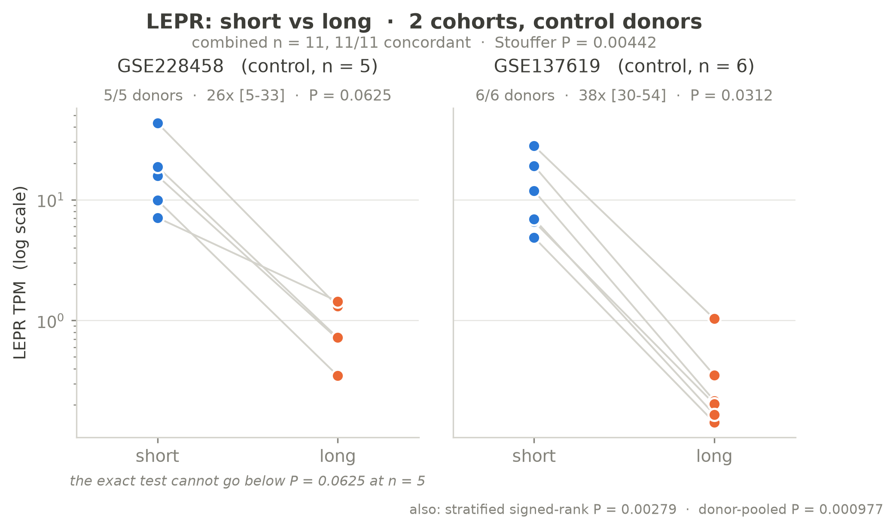

# isoform-dominance

[](https://github.com/charliekim97/isoform-dominance-pipeline/actions/workflows/ci.yml)
[](https://pypi.org/project/isoform-dominance/)


[](https://doi.org/10.5281/zenodo.20672051)

**Is this functional isoform-class comparison measurable by short reads? Answer that first, then quantify and test it — one config away for any gene.**

Most isoform analyses stumble on two things: deciding *which transcripts form a functional
class*, and knowing whether short reads can resolve the classes at all. `isoform-dominance`
handles both, then quantifies and tests the comparison end-to-end:

```
annotate  gene symbol      → proposed isoform groups        (Ensembl, by 3' terminal exon)
identify  config           → is the class contrast estimable, and how precisely?
extract   Salmon quant.sf  → per-donor isoform-group TPM
stats     per-donor TPM    → paired Wilcoxon, per cohort + stratified combination, + figure
qc        marker TPM       → contamination control (is the signal a cell-type artifact?)
```



*Bundled self-test: short LEPR isoform (LepRa) predominates over the long isoform (LepRb) in
control human choroid plexus, in each of two independent cohorts (5/5 and 6/6 donors). The
pooled figure (n = 11, P = 1×10⁻³) is reported alongside the stratified combinations — see
[Statistical notes](#statistical-notes) for why the stratified ones are the numbers to quote.*

---

## Install

```bash
pip install isoform-dominance          # released version
isoform-dominance --version
```

From a clone, for development:

```bash
pip install -e ".[dev]"
pytest -q
```

## Verify it works (no downloads, seconds)

```bash
isoform-dominance selftest
# or: pytest -q
```
reproduces the LEPR reference result (5/5, 6/6, combined n=11 P=9.8e-4) on a clean machine.

## What makes it more than a quantifier

**1. Auto isoform grouping (`annotate`).** Give a gene symbol; it pulls the gene's
protein-coding transcripts from Ensembl, clusters them by their 3' terminal-exon splice
acceptor (the alternative last exon that defines functional isoform classes), and proposes a
comparison you review and rename.
```bash
isoform-dominance annotate --gene LEPR --out config.json
#   iso_896aa : 7 transcripts   (short / LepRa)
#   iso_1165aa: 2 transcripts   (long / LepRb, canonical)
```

**2. Identifiability guardrail (`identify`).** A short-read quantifier apportions fragments
by solving a linear inverse problem; a class total is recoverable only when it is an
*estimable* function of that system. This checks the condition directly, on the class-collapsed
system, and **refuses to pretend** a comparison is measurable when it isn't.

```bash
isoform-dominance identifiability --config config.json \
    --background-fasta gencode.v44.transcripts.fa.gz --read-length 100 --tpm 5
#   background: 9 same-gene transcript(s), FASTA gencode.v44.transcripts.fa.gz
#   design: paired 100bp reads, fragments 200+-60, depth 30M, TPM 5, n=1
#   [identifiable] iso_896aa : 3399 unique k-mers, 3429 bp in 1 block(s), ~412 informative reads, conditioning 1.9
#   [identifiable] iso_1165aa: 5369 unique k-mers, 5399 bp in 1 block(s), ~688 informative reads, conditioning 2.0
#   contrast iso_896aa vs iso_1165aa: identifiable (conditioning 3.5)
#   VERDICT: identifiable
```

Exit codes: **0** identifiable · **3** weakly identifiable (estimable, but ill-conditioned or
starved of informative fragments at the stated design) · **2** not identifiable (no depth fixes
it) · **1** config error.

> **Why not just count unique k-mers?** Because that proxy — used by this package up to
> v2.1.1 — is wrong in both directions. A class whose only unique sequence is the ~30 k-mers
> spanning one splice junction *passes* while yielding a handful of usable fragments. A class nested inside another owns no unique k-mer at all and *fails*, yet its
> total is still an estimable function of the system: the containing class is pinned by its own
> unique sequence, so the nested class's indicator lies in the row space. That is an algebraic
> fact about the design matrix — **not** a claim that "the EM will work it out", since an EM
> returns numbers for a non-identifiable model just as readily. Both cases are regression-tested
> in `tests/test_identifiability_model.py`.

**What it checks, in three layers** — all from sequence alone, before any read is quantified:

> **Pass `--background-fasta`.** The default background is the gene's own remaining
> transcripts, which is better than comparing the configured classes alone but still
> blind to pseudogenes, paralogues and homologous loci elsewhere in the index. A
> quantifier resolves fragments against the *whole* index, so any claim about what it
> can separate should be judged against the same FASTA the index was built from. The
> scan is streamed, so a whole-transcriptome background costs memory proportional to
> the gene, not the file.

| Layer | Reports | Why it is not the layer above |
|---|---|---|
| Sequence uniqueness | unique k-mers, bases covered, block structure | judged against a background — the gene's other transcripts by default, the whole index with `--background-fasta` — not just the configured classes |
| Read model | `informative_fraction`, `expected_informative_reads`, counting-noise floor on log2 ratio | informativeness is scored on the **sequenced ends**, not the fragment: a unique region mid-fragment is never observed |
| Estimability | row-space residual, rank, structural conditioning factor, for each class total **and** their contrast | a full-rank system with a near-degenerate contrast passes a rank test and still yields nothing |

The conditioning factor is a **geometry proxy, not a standard error** — it assumes
`Var(y) = sigma^2 I`, which a quantifier does not satisfy. Its thresholds are provisional
pending the simulation study. The three layers answer different questions and can disagree. Structural estimability is
not precision, and neither is a promise that a quantifier's optimiser will land on the
right answer — an EM returns numbers for a non-identifiable model too. What the
estimability layer asserts is narrower and checkable: whether the class contrast is a
linear functional of the observable fragment-class expectations.

## Full workflow (real data)

```bash
# 0) build a decoy-aware index once (Salmon + GENCODE) — see scripts/01_salmon_quant.sbatch
# 1) quantify on an HPC cluster:
sbatch scripts/01_salmon_quant.sbatch                    # -> quant/<donor>/quant.sf
# 2) extract per cohort:
isoform-dominance extract --config config.json --quantdir quant \
    --samplemap example/sample_map_GSE228458.csv --cohort GSE228458 --out perdonor_GSE228458.csv
# 3) stats + figure:
isoform-dominance stats --config config.json --condition control \
    --perdonor GSE228458=perdonor_GSE228458.csv --perdonor GSE137619=perdonor_GSE137619.csv \
    --out results/dominance
# 4) optional contamination control:
isoform-dominance qc --config config.json \
    --markers GSE228458=markers_228.csv --target GSE228458=perdonor_GSE228458.csv --out results/qc
```

## How this relates to existing tools

Differential transcript usage (DTU) is a mature area, and for genome-wide
discovery you should use the established tools — this one does **not** replace them:

- **DEXSeq, DRIMSeq, satuRn** — genome-wide DTU testing. They assume you already
  have a transcript-by-sample count matrix and defined transcript groups.
- **IsoformSwitchAnalyzeR** — rich functional annotation of isoform switches
  (domains, NMD, coding potential) in R/Bioconductor; grouping and import are
  configured by the analyst.
- **fishpond / swish** — rigorously propagates quantification uncertainty using
  Salmon inferential replicates.

**On identifiability specifically**, this package builds on existing work rather than
claiming the idea:

- **Hiller et al. 2009** ([doi:10.1093/bioinformatics/btp544](https://doi.org/10.1093/bioinformatics/btp544))
  — criteria under which isoform abundances are uniquely determined by RNA-seq observations.
- **Ferrer-Bonsoms et al. 2022** ([doi:10.1093/bioinformatics/btab873](https://doi.org/10.1093/bioinformatics/btab873))
  — a read- and fragment-length-aware identifiability criterion, applied genome wide.
- **terminus** ([doi:10.1093/bioinformatics/btaa448](https://doi.org/10.1093/bioinformatics/btaa448))
  — groups transcripts *post hoc, from the data*, by inferential uncertainty.

The first two address **transcript-level** identifiability of the full deconvolution;
`terminus` chooses its groups after seeing the data. Neither answers the question a biologist
arrives with: *is the contrast between two classes I defined on biological grounds estimable?*
Those are different questions with different answers — two transcripts with identical sequence
make each abundance unidentifiable while their **sum** is perfectly identifiable, and
conversely a set of individually identifiable transcripts can define a contrast that is not.

`isoform-dominance` targets that narrower question: *for one gene, which functional isoform
class predominates?* Its specific contributions are (1) going from a **gene symbol** straight
to a reviewed isoform-group proposal, (2) evaluating the **estimability of the user's own
class contrast, before quantification**, and (3) a scriptable Python CLI with a download-free
self-test meant to ship alongside a manuscript. Group proposals are presented for review, not
treated as final.

More documentation: a step-by-step [NTRK2 walkthrough](docs/tutorial_NTRK2.md), a
[gallery of further example genes](docs/example_genes.md) (NTRK2/NTRK3 kinase
truncations and the FLT1 soluble-decoy receptor, all verified short-read
separable), and an [API reference](docs/api.md).

## Statistical notes

- Donor-level two-sided **exact Wilcoxon signed-rank** (`scipy.stats.wilcoxon`), per cohort.
- **Small-n floor is computed, not just documented.** `signed_rank_resolution_floor(n)`
  returns `2^(1-n)` — under the sign-permutation null exactly one assignment puts every
  difference on the same side. At n = 5 that is 0.0625, so no arrangement of five donors
  reaches 0.05. Ties among the absolute differences do **not** raise it. Every test is
  reported with its floor and flagged when the floor exceeds 0.05.
- **Cohorts are combined three ways**, all reported: donor-**pooled** (what v2.1 reported alone),
  a weighted **Stouffer** combination of the per-cohort *exact* tests, and a weighted
  **stratified signed-rank** combination. The latter borrows van Elteren's design-free
  `1/(n+1)` stratum weights but is *not* van Elteren's test, which is a stratified
  **two-sample** rank-sum procedure; these data are paired within donor. Stouffer is the
  default, because at these sample sizes each stratum's exact p-value is trustworthy and the
  normal approximation behind a combined rank statistic is not. Pooling donors from independent studies ranks one cohort's differences
  against another's and lets depth or tissue handling drive the result — quote the stratified
  figures when the cohorts are genuinely independent.
- Effect size = median fold-change **with a donor-bootstrap 95% interval** (seeded, so it
  reproduces).

## Layout

```
src/isoform_dominance/   annotate · identifiability · extract · stats · contamination · cli · _selftest
tests/                   pytest (offline; reproduces the reference result + unit tests)
scripts/01_salmon_quant.sbatch
example/                 config + sample maps
.github/workflows/ci.yml docs/  pyproject.toml  CITATION.cff  LICENSE
```

## Citation

**Version provenance.** Version **2.1.1** was used for the LEPR isoform quantification and
aggregation in a leptin-receptor/LRP1 choroid-plexus manuscript (under revision), and is
archived at [10.5281/zenodo.20738150](https://doi.org/10.5281/zenodo.20738150). Releasing a new
version does **not** alter that record: Zenodo mints a separate version DOI and leaves the old
one in place, and the `v2.1.1` tag and release are left untouched by policy — not because they
are technically immutable, but because a published paper cites them. The `extract`
aggregation behaviour those results rest on is unchanged in 2.2.0, and the bundled self-test
still reproduces the same reference numbers.

Cite this repository (see `CITATION.cff`, DOI 10.5281/zenodo.20672051) and Salmon:
Patro, R. et al. *Nat. Methods* **14**, 417–419 (2017). https://doi.org/10.1038/nmeth.4197

## License

MIT (see `LICENSE`).
