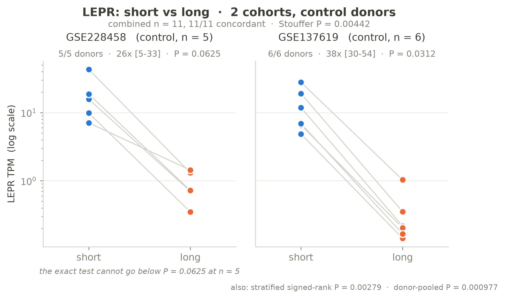

# isoform-dominance

[](https://github.com/charliekim97/isoform-dominance-pipeline/actions/workflows/ci.yml)
[](https://pypi.org/project/isoform-dominance/)


[](https://doi.org/10.5281/zenodo.20672051)

**Is this functional isoform-class comparison measurable by short reads? Answer that first, then quantify and test it — one config away for any gene.**

Most isoform analyses stumble on two things: deciding *which transcripts form a functional
class*, and knowing whether short reads can resolve the classes at all. `isoform-dominance`
handles both, then quantifies and tests the comparison end-to-end:

```
annotate  gene symbol      → proposed isoform groups        (Ensembl, by 3' terminal exon)
identify  config           → is the class contrast estimable, and how precisely?
extract   Salmon quant.sf  → per-donor isoform-group TPM
stats     per-donor TPM    → paired Wilcoxon, per cohort + stratified combination, + figure
qc        marker TPM       → contamination control (is the signal a cell-type artifact?)
```



*Bundled self-test: short LEPR isoform (LepRa) predominates over the long isoform (LepRb) in
control human choroid plexus, in each of two independent cohorts (5/5 and 6/6 donors). The
pooled figure (n = 11, P = 1×10⁻³) is reported alongside the stratified combinations — see
[Statistical notes](#statistical-notes) for why the stratified ones are the numbers to quote.*

---

## Install

```bash
pip install isoform-dominance          # released version
isoform-dominance --version
```

From a clone, for development:

```bash
pip install -e ".[dev]"
pytest -q
```

## Verify it works (no downloads, seconds)

```bash
isoform-dominance selftest
# or: pytest -q
```
reproduces the LEPR reference result (5/5, 6/6, combined n=11 P=9.8e-4) on a clean machine.

## What makes it more than a quantifier

**1. Auto isoform grouping (`annotate`).** Give a gene symbol; it pulls the gene's
protein-coding transcripts from Ensembl, clusters them by their 3' terminal-exon splice
acceptor (the alternative last exon that defines functional isoform classes), and proposes a
comparison you review and rename.
```bash
isoform-dominance annotate --gene LEPR --out config.json
#   iso_896aa : 7 transcripts   (short / LepRa)
#   iso_1165aa: 2 transcripts   (long / LepRb, canonical)
```
Review it: the proposal is a function of the annotation release too. The alternative class
is the one with the most transcripts, and transcript counts are what a new release changes
most. Across six Ensembl releases from 110 to 116, 30 of the 84 genes in a 109-gene survey
that had two classes at every one were proposed a different pair at some release. LEPR up to
release 115 was proposed the 1165 aa class against a 906 aa class of two transcripts,
because the 896 aa class also had two and ties go to the longer protein; release 116 added
five transcripts to the 896 aa class. When a proposal is decided by such a tie, `annotate`
says so on stderr and lists the tied clusters in the config under `_proposal.tied_with`;
at release 116, 39 of the survey's 100 proposals were ties.

A symbol can name more than one gene on the reference chromosomes, and Ensembl's
`lookup/symbol` returns one of them without saying so: for pseudoautosomal genes such as
CD99 and SHOX the chrY copy, for HERC3 the newer of two genes of that name. `annotate` looks
for the others. Of a chrX/chrY pair it takes the chrX gene — Salmon keeps only the first of
identical sequences, and a GENCODE FASTA lists chrX first — and says so; on any other set it
stops and lists them, and `--gene-id` picks one. The config records `gene_id`, and
`identifiability` fetches the gene background by it.

**2. Identifiability guardrail (`identify`).** A short-read quantifier apportions fragments
by solving a linear inverse problem; a class total is recoverable only when it is an
*estimable* function of that system. This checks the condition directly, on the class-collapsed
system, and reports the smallest fold change the stated design can resolve for each class total
and for the contrast between them. Ask it for the effect size you need:

```bash
isoform-dominance identifiability --config config.json --min-log2fc 0.5
# Identifiability (window=31, canonical k-mers)
#   annotation: Ensembl release 116
#   background: 9 same-gene transcript(s)
#   design: paired 100bp reads, fragments 200+-60, depth 30M, TPM 10, n=1
#   [identifiable] iso_1165aa: min |log2FC| 0.064; class 5369 unique k-mers; best transcript 5399 bp in 1 block(s), ~1072 informative reads; conditioning 3.62
#   [identifiable] iso_896aa: min |log2FC| 0.216; class 356 unique k-mers; best transcript 208 bp in 2 block(s), ~63 informative reads; conditioning 115.05
#   contrast iso_896aa vs iso_1165aa: min |log2FC| 0.234; identifiable, conditioning 117.68
#   effective length: iso_896aa 5103 bp vs iso_1165aa 8072 bp (mean per transcript), log2 ratio -0.66
#   distinguishing windows (0 = 5' end, 1 = 3' end of each transcript): iso_896aa median 0.07 [0.05-0.12], 372 positions over 7 transcript(s); iso_1165aa median 0.67 [0.51-0.84], 10738 positions over 2 transcript(s)
#   unique-read counting floor on log2 ratio: SE 0.187 per donor, min resolvable |log2FC| 0.366 at n=1
#   EFFECT SIZE: |log2FC| 0.500 resolved by both class totals and the contrast at this design
#   VERDICT: identifiable
# exit status 0; with --min-log2fc 0.1 the same run reports NOT resolved and exits 3
```

This example is a counterexample to the skew direction the command states (see below):
iso_896aa is the shorter class but is distinguished at its 5' end (median 0.07), and in the
simulation its bias ran against that direction under 5 of the 6 skews.

The release-116 sequences behind the 2026-09-11 block this replaces, run offline through
`--sequences` and `--background-sequences` with the nine same-gene background transcripts;
transcript and k-mer counts move as the annotation does. The `effective length` and
`distinguishing windows` lines were added from a live run against the same release on
2026-09-13, in which every other line reproduced unchanged. The header and the per-class
lines are shown as 2.4.1 prints them; the figures are those runs'. Read the `min |log2FC|` figures first:
they are what the verdict and the exit status are built on. `conditioning` is a diagnostic.
Without `--min-log2fc` the verdict falls back to `--tau` on the conditioning factor, which has
no calibrated value — the same run then reads `weakly_identifiable` — and the command says on
stderr that the verdict is a screening flag, not the exit status.

`effective length` and `distinguishing windows` say how exposed the comparison is to
positional coverage skew, which none of the figures above models (see *It bounds spread, not
accuracy* below). In simulation, Salmon split ambiguous fragments between the classes by
effective length under skew, so the class effective-length ratio tracked the size of the error
and, with the direction of the skew, its sign. Positions are fractions of each transcript's own length, 0 at
the 5' end, because skew acts on each molecule in its own coordinates. When the classes differ
at least 1.23-fold (|log2 ratio| >= 0.3) the command says on stderr which class each direction
of skew tends to inflate, with the evidence: in a 49-gene simulation (Salmon, one quantifier,
monotone positional skew) the 5' direction held for 35–36 of the 39 genes above that ratio, the
3' direction for 30–32, against 20 of 39 at uniform coverage. No other quantifier, gene panel
or form of skew was tested, and below that ratio nothing was measured, so nothing is said.

Exit codes: **0** no `--min-log2fc` given, or it is resolved · **3** `--min-log2fc` given and
not resolved at the stated design · **2** precondition failure: the gene total itself is not
estimable, because a transcript shorter than `--window` has no windows · **1** config or
network error. The structural verdict is never the exit status: it changes with the
annotation release the transcripts came from, so it is reported in the output and in the
`--json` report (`verdict`, with `gene_total` and `effect_resolvable` beside it).

> **Why not just count unique k-mers?** Because that proxy — used by this package up to
> v2.1.1 — is wrong in both directions. A class whose only unique sequence is the ~30 k-mers
> spanning one splice junction *passes* while yielding a handful of usable fragments. A class nested inside another owns no unique k-mer at all and *fails*, yet its
> total is still an estimable function of the system: the containing class is pinned by its own
> unique sequence, so the nested class's indicator lies in the row space. That is an algebraic
> fact about the design matrix — **not** a claim that "the EM will work it out", since an EM
> returns numbers for a non-identifiable model just as readily. Both cases are regression-tested
> in `tests/test_identifiability_model.py`.

**What it checks, in three layers** — all from sequence alone, before any read is quantified:

> **Pass `--background-fasta`.** The default background is the gene's own remaining
> transcripts, which is better than comparing the configured classes alone but still
> blind to pseudogenes, paralogues and homologous loci elsewhere in the index. A
> quantifier resolves fragments against the *whole* index, so any claim about what it
> can separate should be judged against the same FASTA the index was built from. The
> scan is streamed one record at a time, so its memory is set by the longest record, not
> by the file: one 20 Mb record took about 110 MB resident, 10,000 records of 2 kb
> totalling the same 34 MB, at roughly 2 Mb of sequence a second (measured 2026-10-01). A record with the sequence of a configured transcript is not
> counted, because Salmon's default index keeps one of identical sequences: in GENCODE
> v50's reference-chromosome FASTA, all 382 chrY transcripts of the 18 protein-coding
> genes on both chrX and chrY are such records. For an index built with Salmon's
> `--keepDuplicates`, pass `--keep-duplicates`.

> **Pin the release.** The verdict is a function of the annotation release. Rebuilt with
> `--ensembl-release` against six Ensembl releases from 110 (GENCODE 44, July 2023) to 116,
> a 109-gene survey went from 2,005 transcripts to 4,396, nearly all of it in the last two
> releases, where GENCODE added transcripts from long-read data through its TAGENE
> pipeline: protein-coding ones at 115, protein-coding and nonsense-mediated-decay ones at
> 116. Of the 100 comparisons `annotate` proposes at release 116, 38 could not be posed
> at 110 at all, because one of the two classes had no protein-coding transcript there; of the
> 62 that could, 12 change verdict between the two. NTRK3's is `identifiable` at every one of
> those releases before 116 and `not_identifiable` at 116. The exit status moves too: at
> `--min-log2fc 1.0` it changes across the six for 10 of the 62. `annotate` records
> the release it fetched from as `ensembl_release`, and `identifiability` prints it in its
> header and carries it in the `--json` report, beside `fetched_release`, the release any
> sequence was fetched from in that run. Both commands take `--ensembl-release N`: without
> it they read the release `rest.ensembl.org` serves — 116, the last one Ensembl publishes
> on its REST API; later releases are on the new Ensembl platform only, which has none —
> and with it they read release N from Ensembl's REST archive, after checking that the
> server reports N. A config annotated against release 110 is re-run against 110 with
> `identifiability --config config.json --ensembl-release 110`, and the command names that
> flag when the two differ. Archives do not last: none from release 104 or earlier
> answered on 2026-09-24, and 111's timed out for most of that day. For a verdict that has
> to outlive them, add `--save-inputs run.json`, which writes the sequence the run used,
> the release it came from and the k, window and k-mer convention it was built at;
> `identifiability --config config.json --inputs run.json` then repeats the run with no
> request at all. The file holds the gene, not one grouping of it: a rerun pools its
> class and background sequence and splits it again by the config in hand, so a class the
> config has narrowed still has the transcripts it dropped in the background, where a
> live run puts them, and a transcript moved the other way is used rather than refused.
> `--background-fasta` is not copied into that file, but its SHA-256 is, and a rerun given
> no FASTA or another one says so, as does one at another k or window. A verdict quoted
> without a release is not a reproducible claim.

| Layer | Reports | Why it is not the layer above |
|---|---|---|
| Sequence uniqueness | unique k-mers, bases covered, block structure | judged against a background — the gene's other transcripts by default, the whole index with `--background-fasta` — not just the configured classes |
| Read model | `informative_fraction`, `expected_informative_reads`, counting-noise floor on log2 ratio | informativeness is scored on the **sequenced ends**, not the fragment: a unique region mid-fragment is never observed |
| Estimability | row-space residual, rank, and `min_resolvable_log2fc` from the Poisson-weighted GLS covariance, for each class total **and** their contrast; the structural conditioning factor as a diagnostic | a full-rank system with a near-degenerate contrast passes a rank test and still yields nothing |

The headline figure is `min_resolvable_log2fc`: the smallest |log2 fold change| a 95% interval
excludes zero for at the stated design, under Poisson counting error only.

**It bounds spread, not accuracy.** The figure is built from the delta-method standard error
of the log class ratio, so it describes replicate scatter under uniform coverage and a
correctly specified compatibility model. It says nothing about bias when coverage is not
uniform. In simulation (Salmon, 49 genes, 30 replicates each; 39 genes estimable with a
finite predicted SE in all seven coverage models, each a monotone positional skew), no
gene's |bias| reaches its own predicted SE at uniform coverage: 0 of 39. At a 2.3× ratio
between first- and last-decile gene-body coverage, a routine mildly degraded sample, 20–24
of 39 exceed it, depending on the direction of the skew. The replicate SD meanwhile stays
below the predicted SE in 34–37 of 39, as it did in 35 of 39 at uniform coverage, so the
scatter gives no sign of the bias. NTRK3 holds a replicate SD of 0.016–0.025 while its bias
runs from 0.002 to 2.82 log2. **Replicate agreement does not detect this failure.**
Measure your own libraries' gene-body coverage (RSeQC `geneBody_coverage.py`) before reading
the figure as an error bar.

The conditioning factor is kept as a **diagnostic**, not a headline — a **geometry proxy, not a standard
error** — it assumes `Var(y) = sigma^2 I`, which a quantifier does not satisfy, and it moves by
up to two orders of magnitude with the annotation release. Its thresholds are provisional. The three
layers answer different questions and can disagree. Structural estimability is
not precision, and neither is a promise that a quantifier's optimiser will land on the
right answer — an EM returns numbers for a non-identifiable model too. What the
estimability layer asserts is narrower and checkable: whether the class contrast is a
linear functional of the observable fragment-class expectations.

## Full workflow (real data)

```bash
# 0) build a Salmon index once -- the commands are under "Index scope" below:
#    - from the GENCODE release that matches `annotate --ensembl-release`
#      (https://www.gencodegenes.org/human/releases.html), and
#    - from reference-chromosome transcripts only
# 1) quantify on an HPC cluster, one output directory per cohort (both example sample maps
#    name their donors ctrl1-ctrl5, and the script skips a donor whose quant.sf exists):
sbatch --export=ALL,SAMPLE_MAP=example/sample_map_GSE228458.csv,OUTDIR=quant/GSE228458 \
    scripts/01_salmon_quant.sbatch                       # -> quant/GSE228458/<donor>/quant.sf
sbatch --export=ALL,SAMPLE_MAP=example/sample_map_GSE137619.csv,OUTDIR=quant/GSE137619 \
    scripts/01_salmon_quant.sbatch
# 2) extract per cohort:
isoform-dominance extract --config config.json --quantdir quant/GSE228458 \
    --samplemap example/sample_map_GSE228458.csv --cohort GSE228458 --out perdonor_GSE228458.csv
isoform-dominance extract --config config.json --quantdir quant/GSE137619 \
    --samplemap example/sample_map_GSE137619.csv --cohort GSE137619 --out perdonor_GSE137619.csv
# 3) stats + figure:
isoform-dominance stats --config config.json --condition control \
    --perdonor GSE228458=perdonor_GSE228458.csv --perdonor GSE137619=perdonor_GSE137619.csv \
    --out results/dominance
# 4) optional contamination control:
isoform-dominance qc --config config.json \
    --markers GSE228458=markers_228.csv --target GSE228458=perdonor_GSE228458.csv --out results/qc
```

### Index scope

From GENCODE release 48, `gencode.vX.transcripts.fa.gz` holds the transcripts on
scaffolds, patches and alternate loci as well as those on the reference chromosomes;
releases 44–47 hold the reference chromosomes only. The change is in the release-48 entry
of the changelog in GENCODE's FTP `_README.TXT`; the file description in the same README
still calls the file reference-chromosome only. Ensembl's `cdna.all.fa.gz` holds both too
(checked for release 116). A gene with a copy on such a region (SMN1, HLA-A) is in that
FASTA twice, under its own name and another gene id. An index built from it lets the
quantifier split the gene's reads with the copy — Salmon folds an identical copy into the
reference transcript, but splits reads with a copy that differs, and kallisto splits them
either way — and `extract` counts only the configured transcript ids, so the class totals
are biased. Build the index from reference-chromosome transcripts only. For GENCODE, keep
the transcripts of the reference-chromosome GTF (`gencode.vX.annotation.gtf.gz`):

```bash
gzip -dc gencode.v50.annotation.gtf.gz | awk -F'\t' '$3=="transcript"' \
  | grep -o 'transcript_id "[^"]*"' | cut -d'"' -f2 | sort -u > chr_ids.txt
gzip -dc gencode.v50.transcripts.fa.gz \
  | awk 'NR==FNR {keep[$1]; next} /^>/ {split(substr($0,2), h, "|"); p = (h[1] in keep)} p' chr_ids.txt - \
  > gencode.v50.transcripts.chr.fa
grep -c '^>' gencode.v50.transcripts.chr.fa    # = wc -l < chr_ids.txt  (644,292 for v50)
```

For Ensembl `cdna.all`, keep the records whose header region
(`chromosome:GRCh38:<name>:…`) is 1–22, X, Y or MT:

```bash
gzip -dc Homo_sapiens.GRCh38.cdna.all.fa.gz \
  | awk '/^>/ {split($3, r, ":"); p = (r[3] ~ /^([1-9]|1[0-9]|2[0-2]|X|Y|MT)$/)} p' \
  > Homo_sapiens.GRCh38.cdna.primary.fa
```

Then build the index from the filtered FASTA, once, and quantify every donor of a cohort
against it (the sbatch script's `INDEX`):

```bash
salmon index -t gencode.v50.transcripts.chr.fa -i salmon_index_v50chr -k 31 -p 12
```

Without `--gencode`, `quant.sf` names keep the whole GENCODE header, which is what lets
`extract` check them for same-name copies; with it, names are cut to the transcript id and
`extract` reads them just the same.

The package checks for such an index where it can. `identifiability
--background-fasta` warns when the FASTA holds a transcript with the configured gene's
name under another gene id, and so does `extract` when `quant.sf` names carry the whole
GENCODE header (an index built without Salmon's `--gencode`). Only an Ensembl header says
where a gene lies, so a same-name gene on a reference chromosome — the chrY copy of a
pseudoautosomal gene such as CD99 or SHOX, or a distinct gene sharing the name — is left
out there, and reported from a GENCODE header as a possible copy. `extract` also writes
`<out>.index.json`, which records the index each donor was quantified against (from
Salmon's `aux_info/meta_info.json`), and it stops when one cohort mixes indexes, unless
`--allow-mixed-index` is given. It also counts the configured transcripts in each
`quant.sf`: a cohort with none of them is refused, and some missing is a warning. Salmon
drops all but the first of identical sequences when it builds an index (the index's
`duplicate_clusters.tsv` lists them), so a config that names a dropped copy finds nothing.

## How this relates to existing tools

Differential transcript usage (DTU) is a mature area, and for genome-wide
discovery you should use the established tools — this one does **not** replace them:

- **DEXSeq** — differential *exon* usage, from exon-bin counts, with its own counting
  scripts.
- **DRIMSeq, satuRn** — genome-wide transcript-level DTU testing. They assume you already
  have a transcript-by-sample count matrix and defined transcript groups.
- **IsoformSwitchAnalyzeR** — genome-wide isoform-switch testing with rich functional
  annotation of the switches (domains, NMD, coding potential) in R/Bioconductor; grouping
  and import are configured by the analyst.
- **Kmerator** ([doi:10.1093/nargab/lqab058](https://doi.org/10.1093/nargab/lqab058)) —
  builds gene- and transcript-specific k-mer signatures against a reference, the
  uniqueness question this package's first layer asks, without a verdict on a contrast.
- **fishpond / swish** — rigorously propagates quantification uncertainty using
  Salmon inferential replicates.

**On identifiability specifically**, this package builds on existing work rather than
claiming the idea:

- **Hiller et al. 2009** ([doi:10.1093/bioinformatics/btp544](https://doi.org/10.1093/bioinformatics/btp544))
  — criteria under which isoform abundances are uniquely determined by RNA-seq observations.
- **Ferrer-Bonsoms et al. 2022** ([doi:10.1093/bioinformatics/btab873](https://doi.org/10.1093/bioinformatics/btab873))
  — a read- and fragment-length-aware identifiability criterion, applied genome wide.
- **terminus** ([doi:10.1093/bioinformatics/btaa448](https://doi.org/10.1093/bioinformatics/btaa448))
  — groups transcripts *post hoc, from the data*, by inferential uncertainty.

The first two address **transcript-level** identifiability of the full deconvolution;
`terminus` chooses its groups after seeing the data. Neither answers the question a biologist
arrives with: *is the contrast between two classes I defined on biological grounds estimable?*

Two different questions hide under the same word, and keeping them apart is the whole reason
this package exists. A contrast is **estimable** when it lies in the row space of the
compatibility system — a yes/no in exact arithmetic. It is **measurable** when it can actually
be recovered at a finite sequencing depth. Transcript-level identifiability settles the first
in one direction only, and is silent on the second.

- **It is not necessary for estimability.** Two transcripts with identical sequence make each
  abundance unidentifiable while their **sum** is perfectly estimable. A transcript-level
  verdict can reject a comparison that is in fact sound.
- **It is sufficient for estimability — and that is the problem.** If every transcript is
  identifiable the design matrix has full column rank, so *every* contrast is estimable. The
  row-space condition is then satisfied trivially and stops discriminating exactly where you
  need it to.
- **It is not sufficient for measurability.** Full rank says nothing about finite depth: the
  class direction can be so weakly observed that a formally estimable contrast is
  unrecoverable. `identifiability` therefore reports the **smallest resolvable effect size
  beside the row-space verdict**, and neither on its own.

`isoform-dominance` targets that question: *for one gene, which functional isoform class
predominates?* The contribution is evaluating the **estimability of the user's own class
contrast, before quantification** — a check none of the tools above performs. Taking a gene
name as input is not new (Kmerator does), and is not the claim. Around that sit two conveniences rather than claims: `annotate` goes
from a gene symbol to a reviewed isoform-group proposal (presented for review, not treated as
final), and the whole thing is a scriptable Python CLI with a download-free self-test, meant to
ship alongside a manuscript.

More documentation: a step-by-step [NTRK2 walkthrough](docs/tutorial_NTRK2.md), a
[gallery of further example genes](docs/example_genes.md) (NTRK2/NTRK3 kinase
truncations and the FLT1 soluble-decoy receptor), and an [API reference](docs/api.md).

## Statistical notes

- Donor-level two-sided **Wilcoxon signed-rank** (`scipy.stats.wilcoxon`, `method="auto"`), per
  cohort. It is exact only with neither a zero difference nor a tie among the absolute
  differences (and n ≤ 50); otherwise SciPy runs an exhaustive permutation test at n ≤ 13 and
  the normal approximation above that. Which one produced each p-value is reported
  (`wilcoxon_method`) — at n = 14 with one tie the approximation can sit well above the
  exact figure.
- **Small-n floor is computed, not just documented.** `signed_rank_resolution_floor(n)`
  returns `2^(1-n)` — under the sign-permutation null exactly one assignment puts every
  difference on the same side. At n = 5 that is 0.0625, so no arrangement of five donors
  reaches 0.05. Ties among the absolute differences do **not** raise it. Each per-cohort test
  and the donor-pooled one is reported with its floor and flagged when the floor exceeds
  0.05; the Stouffer and stratified rows of the stats table carry none yet.
- **Cohorts are combined three ways**, all reported: donor-**pooled** (what v2.1 reported alone),
  a weighted **Stouffer** combination of the per-cohort *exact* tests, and a weighted
  **stratified signed-rank** combination. The latter borrows van Elteren's design-free
  `1/(n+1)` stratum weights but is *not* van Elteren's test, which is a stratified
  **two-sample** rank-sum procedure; these data are paired within donor. Stouffer is the
  default, because at these sample sizes each stratum's exact p-value is trustworthy and the
  normal approximation behind a combined rank statistic is not. Pooling donors from independent studies ranks one cohort's differences
  against another's and lets depth or tissue handling drive the result — quote the stratified
  figures when the cohorts are genuinely independent.
- Effect size = median fold-change **with a donor-bootstrap 95% interval** (seeded, so it
  reproduces).

## Layout

```
src/isoform_dominance/   annotate · identifiability · extract · stats · contamination · cli · _selftest
tests/                   pytest (offline; reproduces the reference result + unit tests)
scripts/01_salmon_quant.sbatch
example/                 config + sample maps
.github/workflows/ci.yml docs/  pyproject.toml  CITATION.cff  LICENSE
```

## Citation

**Version provenance.** Version **2.1.1** was used for the LEPR isoform quantification and
aggregation in a leptin-receptor/LRP1 choroid-plexus manuscript (under revision), and is
archived at [10.5281/zenodo.20738150](https://doi.org/10.5281/zenodo.20738150). Releasing a new
version does **not** alter that record: Zenodo mints a separate version DOI and leaves the old
one in place, and the `v2.1.1` tag and release are left untouched by policy — not because they
are technically immutable, but because the manuscript under revision cites them. The `extract`
aggregation behaviour those results rest on — transcript-to-group mapping and per-donor TPM
summation — is unchanged through 2.4.0, and the bundled self-test still reproduces the same
reference numbers. 2.4.0 adds two refusals to `extract` where 2.3.0 wrote a table: a cohort
quantified against more than one Salmon index, and a config none of whose transcripts is in
any donor's `quant.sf`.

Cite this repository (see `CITATION.cff`, DOI 10.5281/zenodo.20672051) and Salmon:
Patro, R. et al. *Nat. Methods* **14**, 417–419 (2017). https://doi.org/10.1038/nmeth.4197

## License

MIT (see `LICENSE`).
